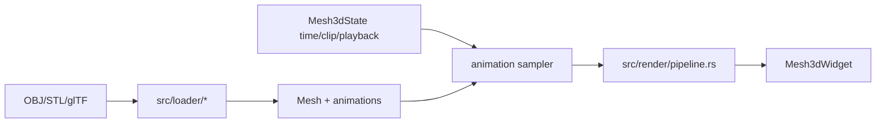

# Requirements

## Goals
- Add animation support in a Rust-idiomatic way for the formats this crate currently supports.
- Preserve all current static model behavior for OBJ, STL, and non-animated glTF/GLB files.
- Make animation usable both from the reusable Ratatui widget API and from the example viewer.
- Keep the implementation maintainable: format-neutral public animation types, glTF-specific import code, and rendering/evaluation helpers separated cleanly.

## Format scope
- **glTF/GLB**: implement embedded animation clip import and playback. The current `gltf` dependency documents animation channels, targets, samplers, `read_inputs()`, and `read_outputs()`, which is the right source for this.
- **OBJ/STL**: these formats do not normally contain embedded animation. They should remain supported as static meshes with `mesh.animations.is_empty()` and no special runtime failures.

## Functional requirements
- Load animation clips from animated glTF/GLB files.
- Expose clip metadata: name, duration, channel count, and selected/current playback state.
- Support play/pause, looping playback, clip switching, restart, and playback speed in the example viewer.
- Keep existing render modes, color modes, textures, brightness, controls, and loading options intact.

## Non-goals for this first pass
- Do not add FBX/Collada or new heavyweight animation dependencies.
- Do not redesign the terminal lifecycle; embedders still own the event loop and call `Mesh3dState::tick`.
- Treat advanced glTF features like full skinning/morph-target animation as explicit follow-up scope unless the imported asset can be animated with node TRS channels alone.

# Technical Design

## Current implementation verified
- `src/model.rs::Mesh` is a static mesh: vertices, UVs, normals, faces, materials, textures, bounds.
- `src/loader/mod.rs::load_with_options` dispatches by extension to OBJ/STL/glTF loaders.
- `src/loader/gltf.rs::load_gltf` currently imports glTF geometry/materials/textures and flattens node transforms into static vertices.
- `src/render/pipeline.rs::render_mesh` renders a `&Mesh` using `Mesh3dState` view rotation/pan/zoom and `Mesh3dConfig` render/color settings.
- `src/widget.rs::Mesh3dState::tick` already receives `delta_seconds`, but today only advances auto-spin.
- `examples/viewer.rs` already has a fixed timestep loop and status panel, so it is the natural place to expose playback UX.

## Proposed structure
- Add `src/animation.rs` for reusable animation data and sampling helpers rather than bloating `model.rs` or `render/pipeline.rs`.
- Extend `Mesh` with animation clips and lightweight scene/node binding data needed to apply sampled node transforms to vertex ranges.
- Keep loaders responsible for importing source-format data:
  - OBJ/STL: empty animations.
  - glTF/GLB: parse `document.animations()` and channel target node/property data.
- Keep rendering responsible for drawing the current sampled pose:
  - `Mesh3dState` stores selected clip/time/speed/playback flags.
  - `render_mesh` samples active animation, then runs the existing projection/rasterization path.



## glTF animation details
- Parse channel inputs as keyframe times and outputs as translation/rotation/scale values.
- Support `Step` and `Linear` interpolation first; use safe fallback/clear docs for unsupported cubic spline output.
- Store base node transforms so sampled animation composes on top of the original scene transform.
- Preserve current static output for time `0.0` / no active animation to reduce regression risk.

## API shape
- Public users should be able to:
  - inspect `mesh.animations`,
  - select a clip on `Mesh3dState`,
  - call `state.tick(dt, &config)`,
  - render the existing `Mesh3dWidget` normally.
- Existing `Mesh::load`, `Mesh::load_with_options`, and `Mesh3dWidget::new(&mesh)` should keep working.

# Testing

## Automated checks
Run the existing quality gates after implementation:

```bash
cargo fmt --all -- --check
cargo check --no-default-features
cargo check --all-features
cargo check --examples --all-features
cargo test --all-features
cargo clippy --all-targets --all-features -- -D warnings
RUSTDOCFLAGS='-D warnings' cargo doc --all-features --no-deps
```

## Focused tests to add
- Animation interpolation unit tests for step and linear sampling.
- Playback state tests for play/pause, looping, restart, speed, and clip selection bounds.
- Loader tests that static OBJ/STL meshes expose zero clips.
- glTF loader tests that animated fixtures expose expected clip metadata and channel targets.
- Regression tests that non-animated glTF and static files still load/render as before.

## Manual smoke commands
- Static OBJ/STL should still work with no animation status errors.
- Animated/static axe glTF should still run:

```bash
cargo run --release --example viewer --features "cli-example gltf textures" -- \
  models/axe/scene.gltf
```

The status panel should show animation availability, current clip, time/duration, speed, and play/pause state when clips exist.

# Delivery Plan
1. Add animation model API
The crate gains a format-neutral animation data model while static OBJ/STL behavior stays unchanged.
- Add public animation structs/enums in a focused module such as `src/animation.rs`: `AnimationClip`, `AnimationChannel`, `AnimationSampler`, `AnimatedProperty`, `Interpolation`, `NodeTransform`, and a small `Quaternion` type or equivalent rotation representation.
- Extend `src/model.rs::Mesh` with `animations: Vec<AnimationClip>` and scene/node metadata needed to map animated transforms onto already-loaded geometry; ensure `Mesh::new`, `Mesh::with_attributes`, and `Mesh::normalized` preserve/copy animation metadata safely.
- Keep OBJ/STL loaders in `src/loader/obj.rs` and `src/loader/stl.rs` returning meshes with an empty `animations` list so all current files remain valid and API users can check `mesh.animations.is_empty()`.
- Export the new animation types from `src/lib.rs` with rustdoc explaining that glTF/GLB can contain embedded clips while OBJ/STL are static formats.

2. Import glTF animation clips
The glTF/GLB loader imports embedded animation clips and enough node/primitive mapping to evaluate them.
- Update `src/loader/gltf.rs` to collect glTF node indices, base transforms, and per-node primitive vertex ranges instead of only flattening one static transform into positions.
- Parse `document.animations()` using `channel.reader(...)` / `read_inputs()` / `read_outputs()` from the `gltf` crate, supporting translation, rotation, and scale channels with linear/step interpolation and safe fallback for unsupported cubic spline output.
- Preserve existing material, UV, normal, texture, and transform behavior for non-animated glTFs; default sampled time `0.0` should render identically to the current static output.
- Add loader tests using `models/axe/scene.gltf` when present plus a tiny synthetic glTF fixture or generated fixture to assert clip names/durations/channel counts without requiring large assets.

3. Sample and render animation frames
Rendering can draw a sampled animation frame without forcing embedders to mutate the original mesh.
- Add evaluator helpers that sample an `AnimationClip` at time seconds, apply looping/clamping policy, compose node TRS transforms, and produce frame-local transformed vertices/normals for the renderer.
- Update `src/render/pipeline.rs::render_mesh` to use an optional animation pose from `Mesh3dState` before existing camera rotation/projection, keeping the current `render_mesh(&Mesh, Rect, &mut Buffer, &Mesh3dState, &Mesh3dConfig)` entry point intact.
- Avoid per-frame asset reloads or texture scans; only allocate the minimum transformed vertex/normal buffers needed for the active clip, and preserve current color/brightness/render-mode behavior.
- Include unit tests for interpolation math, looping time normalization, and static/no-animation rendering paths.

4. Expose playback UX
The widget state and example viewer expose intuitive animation playback controls while embedders remain in control of their event loop.
- Extend `src/widget.rs::Mesh3dState` with animation state such as selected clip index, current time, playback speed, looping, and play/pause; update `tick(delta_seconds, &Mesh3dConfig)` to advance playback in addition to current auto-spin.
- Extend `src/config.rs` only for reusable playback defaults if needed, such as default loop mode or initial animation playback; keep rendering configuration separate from animation state where practical.
- Extend `src/controls.rs` and `examples/viewer.rs` with keys for play/pause, next/previous clip, restart, speed up/down, and show clip name/time/duration in the status panel.
- Ensure examples still run for static OBJ/STL files, showing “no animations” rather than failing, and animated glTF/GLB files can be run with `cargo run --release --example viewer --features "cli-example gltf textures" -- models/axe/scene.gltf`.

5. Document and validate animation support
Documentation and validation cover animation support across feature combinations.
- Update `README.md` and `docs/wiki/*` with supported animation scope: glTF/GLB TRS/node animation first, OBJ/STL static/no embedded animation, and clear notes about unsupported advanced glTF features if not implemented in this pass.
- Document the new public API for embedders: inspecting `mesh.animations`, selecting a clip in `Mesh3dState`, calling `state.tick(dt, &config)`, and rendering the same `Mesh3dWidget`.
- Run validation: `cargo fmt --all -- --check`, `cargo check --no-default-features`, `cargo check --all-features`, `cargo check --examples --all-features`, `cargo test --all-features`, `cargo clippy --all-targets --all-features -- -D warnings`, and `RUSTDOCFLAGS='-D warnings' cargo doc --all-features --no-deps`.
- Add or update tests so static loaders, glTF animation import, and animation sampling are covered without making the slow axe fixture the only proof.
