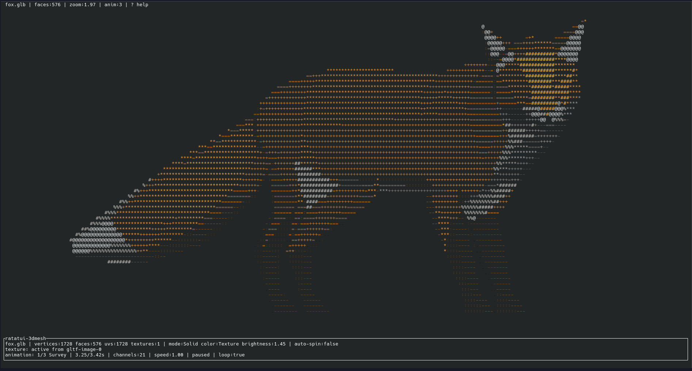
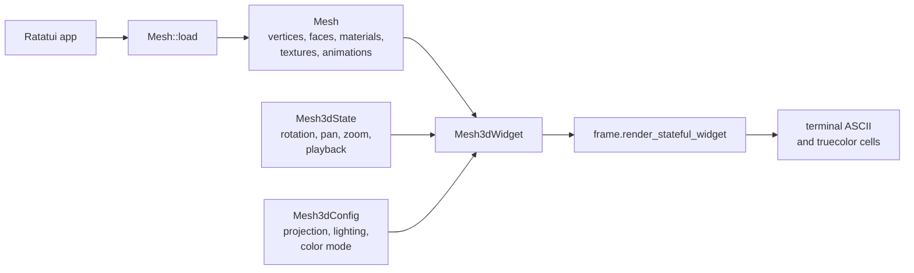

# ratatui-3dmesh

[](https://github.com/vynxc/ratatui-3dmesh/actions/workflows/ci.yml)
[](LICENSE)

A reusable [Ratatui](https://ratatui.rs/) widget for viewing 3D meshes as shaded terminal ASCII with optional truecolor texture output.



[Watch the viewer demo](docs/wiki/media/ratatui-3dmesh-viewer-fox.webm)

`ratatui-3dmesh` is inspired by:

- [`autopawn/3d-ascii-viewer`](https://github.com/autopawn/3d-ascii-viewer) — C/ncurses OBJ ASCII rendering with optional MTL diffuse colors.
- [`luisbedoia/sx3d`](https://github.com/luisbedoia/sx3d) — a simple Rust console 3D viewer UX.

This crate is built for embedding. Your app owns terminal initialization, layout, and event loops; this crate provides mesh loading, configuration, rendering, state, and optional crossterm controls.

> Status: early public crate. Supports OBJ (with companion MTL) and glTF/GLB, glTF node animation playback and CPU skinning, material-aware rendering (double-sided, alpha mask/blend, emissive), UV parsing, texture images, solid/wire/point modes, color policies, controls, docs, and an example viewer.

## Install

Until the crate is published to crates.io, depend on it straight from GitHub:

```toml
[dependencies]
ratatui-3dmesh = { git = "https://github.com/vynxc/ratatui-3dmesh" }
ratatui = "0.29"
```

Pin to a tag or commit for reproducible builds:

```toml
ratatui-3dmesh = { git = "https://github.com/vynxc/ratatui-3dmesh", tag = "v0.1.0" }
```

Once it lands on crates.io, the version form works too:

```toml
[dependencies]
ratatui-3dmesh = "0.1"
ratatui = "0.29"
```

The default features (`obj`, `mtl`, `gltf`, `textures`) load OBJ and glTF/GLB with textures out of the box. For keyboard helpers based on crossterm, add the `cli-example` feature:

```toml
ratatui-3dmesh = { version = "0.1", features = ["cli-example"] }
```

To trim the build to a single format, disable defaults and opt in:

```toml
# OBJ only
ratatui-3dmesh = { version = "0.1", default-features = false, features = ["obj", "mtl"] }

# glTF/GLB only
ratatui-3dmesh = { version = "0.1", default-features = false, features = ["gltf", "textures"] }
```

## Use as a Ratatui widget



```rust,no_run
use ratatui_3dmesh::{Mesh, Mesh3dConfig, Mesh3dState, Mesh3dWidget};

# fn draw(frame: &mut ratatui::Frame<'_>, area: ratatui::layout::Rect) -> ratatui_3dmesh::Result<()> {
let mesh = Mesh::load("model.obj")?;
let config = Mesh3dConfig::default()
    .auto_fit(true)
    .show_hints(true);
let mut state = Mesh3dState::default();

frame.render_stateful_widget(
    Mesh3dWidget::new(&mesh).config(config),
    area,
    &mut state,
);
# Ok(())
# }
```

## Textured OBJ usage

Texture rendering requires OBJ UV coordinates (`vt`) and face UV references such as `f 1/1/1 2/2/2 3/3/3`.

MTL-driven texture:

```text
model.obj  -> mtllib model.mtl
model.mtl  -> map_Kd texture.png
```

Manual texture override for models that have UVs but no usable MTL:

```rust,no_run
use ratatui_3dmesh::{Mesh, MeshLoadOptions};

# fn load() -> ratatui_3dmesh::Result<Mesh> {
let mesh = Mesh::load_with_options(
    "your-model.obj",
    MeshLoadOptions::default()
        .load_material_textures(true)
        .texture_override("your-basecolor.png"),
)?;
# Ok(mesh)
# }
```

The texture loader sniffs image bytes instead of trusting the extension, so a PNG file named `.jpg` can still decode.


## glTF usage

glTF/GLB is supported by default (the `gltf` + `textures` features). `Mesh::load("scene.gltf")` reads mesh primitives, indices, normals, UVs, and full PBR material metadata: base-color factor/texture, `alphaMode` (OPAQUE/MASK/BLEND), `alphaCutoff`, `doubleSided`, and emissive factor/texture. Embedded images are decoded automatically — no opt-in flag needed.

The renderer is material-aware, so authored details survive into the terminal:

- `doubleSided` materials are never back-face culled (hair cards, eye/brow decals).
- `MASK` materials cut out below `alphaCutoff`; `BLEND` materials composite over the geometry behind them in a back-to-front pass.
- Emissive factors and emissive textures add light on top of the lit base color, keeping glowing detail (eye irises, screens) visible even under dim lighting.

```rust,no_run
use ratatui_3dmesh::Mesh;

# fn load() -> ratatui_3dmesh::Result<Mesh> {
let mesh = Mesh::load("examples/assets/gltf/fox.glb")?;
# Ok(mesh)
# }
```

Embedded glTF/GLB animations are imported as `mesh.animations`. This pass supports node translation, rotation, and scale channels with linear or step interpolation, including CPU skinning for glTF meshes with `JOINTS_0`/`WEIGHTS_0`. Morph-target weights and cubic-spline interpolation are left as follow-up scope.

Run a bundled asset:

```bash
cargo run --release --example viewer --features cli-example -- \
  examples/assets/gltf/fox.glb
```

### glTF compatibility sweep

To validate against a broad corpus of real-world models, fetch the Khronos sample assets and run the ignored compatibility test:

```bash
./scripts/fetch-gltf-corpus.sh
GLTF_CORPUS_DIR=models/corpus cargo test --test gltf_corpus \
  --features "gltf textures" -- --ignored --nocapture
```

The test loads every `.gltf`/`.glb` under `GLTF_CORPUS_DIR` and fails on any that error or produce no geometry. Normal `cargo test` runs stay offline and skip it.

## Run the example viewer

The repository ships small, redistributable sample assets under
[`examples/assets`](examples/assets) so the viewer works on a fresh clone:

```bash
cargo run --example viewer --features cli-example
cargo run --example viewer --features cli-example -- examples/assets/pyramid.obj
cargo run --release --example viewer --features cli-example -- examples/assets/gltf/box_textured.glb
cargo run --release --example viewer --features cli-example -- examples/assets/gltf/fox.glb
```

Manual texture override (OBJ with UVs but no usable MTL):

```bash
cargo run --release --example viewer --features cli-example -- \
  your-model.obj --texture your-basecolor.png
```

Controls:

| Key | Action |
| --- | --- |
| Arrow keys / `wasd` | rotate |
| `z` / `x` | roll |
| `hjkl` | pan |
| `+` / `-` | zoom |
| `m` | cycle solid/wireframe/points |
| `c` | cycle material/lighting/texture/auto/off color |
| `o` | toggle perspective/orthographic projection |
| `[` / `]` | decrease/increase color brightness |
| `space` | toggle auto-spin |
| `p` | play/pause animation |
| `n` / `b` | next/previous animation clip |
| `0` | restart animation |
| `,` / `.` | slow down/speed up animation |
| `v` | toggle animation looping |
| `r` | reset view |
| `?` | help overlay |
| `q` / Esc | quit example |

## Supported formats

| Format | Support |
| --- | --- |
| OBJ | vertices, texture coordinates, normals, polygon faces, negative indices, `usemtl`, companion `mtllib` |
| MTL | `newmtl`, diffuse `Kd` colors, diffuse `map_Kd` texture paths |
| glTF/GLB | mesh primitives, indices, normals, UVs, PBR base-color factor/texture, `alphaMode`/`alphaCutoff`, `doubleSided`, emissive factor/texture, node TRS animations, and CPU skinning |
| Textures | embedded glTF images and PNG/JPEG files decode to RGBA8 via the `textures` feature; manual `--texture` override supported for OBJ |

OBJ is a static format and exposes `mesh.animations.is_empty()`. OBJ and glTF primitives without UVs render with material/lighting/grayscale modes.

## Configuration highlights

`Mesh3dConfig` is a typed builder with defaults that work well in a terminal:

- `glyph_ramp(...)` — dark-to-light ASCII ramp.
- `render_mode(RenderMode::{Solid, Wireframe, Points})`.
- `projection(ProjectionMode::{Perspective, Orthographic})`.
- `color_mode(ColorMode::{Material, Lighting, Texture, Auto, Off})`.
- `texture_filter(TextureFilter::{Nearest, Bilinear})`, `texture_wrap(TextureWrap::{Repeat, Clamp})`.
- `flip_texture_v(...)`, `texture_lighting(...)`, `color_brightness(...)`.
- `scale(...)`, `fov_y_degrees(...)`, `cell_aspect_ratio(...)`.
- `backface_culling(...)`, `light_direction(...)`, `lighting(...)`.
- `auto_spin([x, y, z])`, `max_faces(...)`.
- `foreground_style(...)`, `background_style(...)`, `show_hints(...)`, `show_help_overlay(...)`.

Presets:

```rust
let fast = Mesh3dConfig::fast();
let pretty = Mesh3dConfig::quality();
```

## Feature flags

| Feature | Default | Description |
| --- | --- | --- |
| `obj` | yes | Wavefront OBJ loading |
| `mtl` | yes | OBJ material diffuse-color and `map_Kd` metadata loading |
| `gltf` | yes | glTF/GLB mesh, material, UV, animation, and skinning loading |
| `textures` | yes | PNG/JPEG and embedded glTF texture decoding and texture-colored rendering |
| `serde` | no | serialize/deserialize public config/model/state types where practical |
| `cli-example` | no | crossterm keyboard control helpers and example support |

## Public docs / GitHub Wiki

Wiki source lives in [`docs/wiki`](docs/wiki). GitHub Wikis are separate repositories, so these Markdown pages can be copied or synchronized when publishing the project wiki.

## Development

```bash
cargo fmt --all
cargo test --all-features
cargo clippy --all-targets --all-features -- -D warnings
cargo doc --all-features --no-deps
```

Continuous integration runs all of the above plus a feature matrix and an MSRV
(`1.88`) check on every push and pull request. See
[`.github/workflows/ci.yml`](.github/workflows/ci.yml).

## Credits

- ASCII/luminance 3D viewer inspiration: [`autopawn/3d-ascii-viewer`](https://github.com/autopawn/3d-ascii-viewer).
- Rust terminal 3D viewer reference: [`luisbedoia/sx3d`](https://github.com/luisbedoia/sx3d).
- UI framework: [Ratatui](https://ratatui.rs/).
- Image decoding: [`image`](https://crates.io/crates/image) when the `textures` feature is enabled.
- Included example pyramid/tetrahedron assets are simple generated fixtures released under this repository's MIT license.
- Bundled glTF sample models in [`examples/assets/gltf`](examples/assets/gltf) come from the
  [Khronos glTF Sample Assets](https://github.com/KhronosGroup/glTF-Sample-Assets) under
  CC0/CC-BY 4.0; see [`examples/assets/gltf/LICENSE.md`](examples/assets/gltf/LICENSE.md)
  for per-model attribution.

## License

MIT
