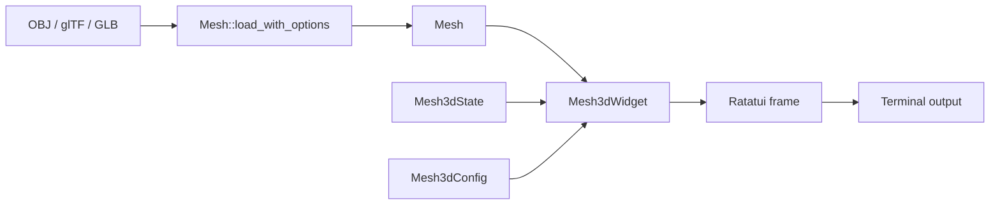

# Getting Started



## Add the crate

Until the crate is published to crates.io, depend on it from GitHub:

```toml
[dependencies]
ratatui-3dmesh = { git = "https://github.com/vynxc/ratatui-3dmesh" }
```

After it is published, the version form works:

```toml
[dependencies]
ratatui-3dmesh = "0.1"
```

Enable keyboard helpers for crossterm apps:

```toml
ratatui-3dmesh = { git = "https://github.com/vynxc/ratatui-3dmesh", features = ["cli-example"] }
```

The default features already include `gltf` and `textures`; disable defaults to trim
the build down to a single format.

## Run the bundled viewer

The repository ships small, redistributable sample assets so the viewer works on a
fresh clone:

```bash
cargo run --example viewer --features cli-example
cargo run --example viewer --features cli-example -- examples/assets/pyramid.obj
```

Run a glTF asset in release mode:

```bash
cargo run --release --example viewer --features "cli-example gltf textures" -- \
  examples/assets/gltf/fox.glb
```

Point it at your own textured OBJ that has UVs but no usable MTL:

```bash
cargo run --release --example viewer --features "cli-example textures" -- \
  your-model.obj --texture your-basecolor.png
```

The `--texture` flag is useful when an OBJ has UVs but no usable MTL file. OBJ + MTL + `map_Kd` textures can load without `--texture` when `load_material_textures` is enabled by the example.

## Basic controls

- Arrow keys / `wasd`: rotate
- `hjkl`: pan
- `+` / `-`: zoom
- `m`: cycle render modes
- `c`: cycle color modes, including texture modes when texture data is loaded

- `[` / `]`: decrease/increase color brightness
- `space`: auto-spin
- `?`: help
- `q`: quit the example
