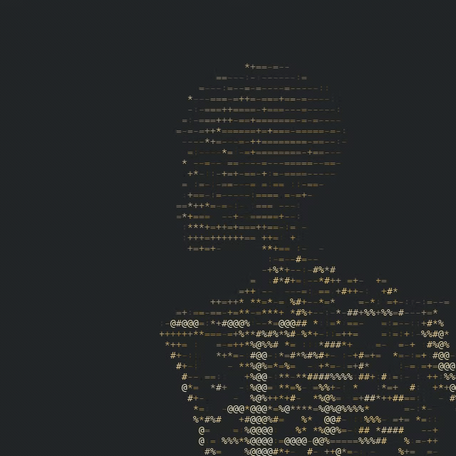

# Home

`ratatui-3dmesh` is an embeddable Ratatui widget for rendering 3D OBJ and glTF/GLB meshes as terminal ASCII.

## Quick links

- [Getting Started](Getting-Started.md)
- [Embedding in Ratatui](Embedding-in-Ratatui.md)
- [Configuration](Configuration.md)
- [Model Formats](Model-Formats.md)
- [Roadmap](Roadmap.md)

## Design goals

- Work as a widget inside existing Ratatui apps.
- Provide good defaults and many typed customization options.
- Support OBJ (with companion MTL) and glTF/GLB, including PBR material semantics.
- Keep terminal initialization outside the library.
